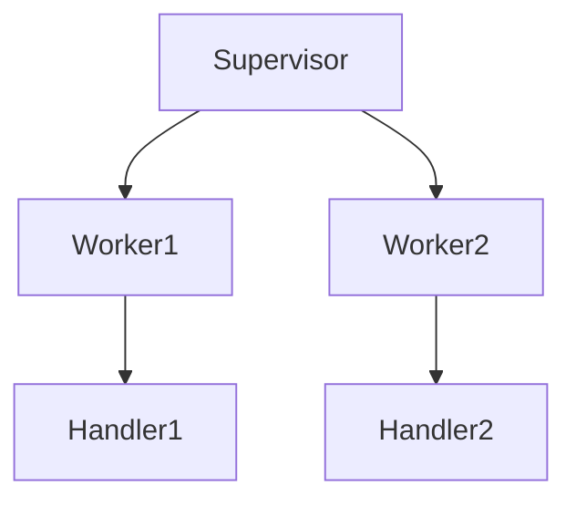

# Extended Markdown Features Demo

This file demonstrates advanced Markdown features supported by most modern editors and platforms.

## Table of Contents
- [Tables](#tables)
- [Task Lists](#task-lists)
- [Code Blocks](#code-blocks)
- [Diagrams](#diagrams)
- [Footnotes](#footnotes)
- [Images](#images)
- [Links](#links)
- [Blockquotes](#blockquotes)
- [Math](#math)

---

## Tables
| Device      | Status   | Last Seen        |
|-------------|----------|------------------|
| CapstanDrive| Online   | 2026-01-25 10:00 |
| AS-410M     | Offline  | 2026-01-24 18:30 |

## Task Lists
- [x] Modularize workers
- [x] Add per-device command dictionaries
- [ ] Implement TCP support
- [ ] Write more tests

## Code Blocks
```python
# Example: Send a UDP command
worker.mailbox.put({"command": "led", "params": {"state": True}})
```

## Diagrams


## Footnotes
Here is a statement with a footnote.[^1]

[^1]: This is the footnote text.

## Images


## Links
- [Project README](../README.md)
- [Architecture](architecture.md)

## Blockquotes
> "Robust error handling is essential for maintainability."

## Math
Inline math: $E = mc^2$

Block math:
$$
\frac{d}{dt}x(t) = Ax(t) + Bu(t)
$$

---
For more, see [GitHub Flavored Markdown Spec](https://github.github.com/gfm/).
